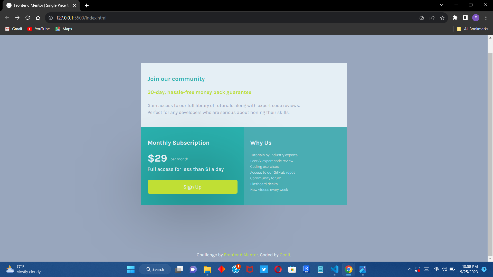

# Frontend Mentor - Single price grid component solution

This is a solution to the [Single price grid component challenge on Frontend Mentor](https://www.frontendmentor.io/challenges/single-price-grid-component-5ce41129d0ff452fec5abbbc). Frontend Mentor challenges help you improve your coding skills by building realistic projects. 

## Table of contents

- [Overview](#overview)
  - [The challenge](#the-challenge)
  - [Screenshot](#screenshot)
  - [Links](#links)
- [My process](#my-process)
  - [Built with](#built-with)
  - [What I learned](#what-i-learned)
  - [Continued development](#continued-development)

## Overview

### The challenge

Users should be able to:

- View the optimal layout for the component depending on their device's screen size
- See a hover state on desktop for the Sign Up call-to-action

### Screenshot

### Links

- Solution URL: [https://github.com/Genii-X/single-grid.git]
- Live Site URL: [Add live site URL here](https://your-live-site-url.com)

## My process

### Built with

- Semantic HTML5 markup
- CSS custom properties
- Flexbox
- CSS Grid
- Mobile-first workflow

### What I learned

- Learnt how to usee CSS Grid coupled with Media Query to create a responsive layout
- Learnt how to explicitly place items in grids

To see how you can add code snippets, see below:

### Continued development

In future projectx I'll be lloking to properly harness the full potential of CSS grid to create layouts. And also how to use the box-shadow property

## Author
- Frontend Mentor - [Genii](https://www.frontendmentor.io/profile/Genii-X)
- Twitter - [Genii](https://www.twitter.com/mild_mide)

